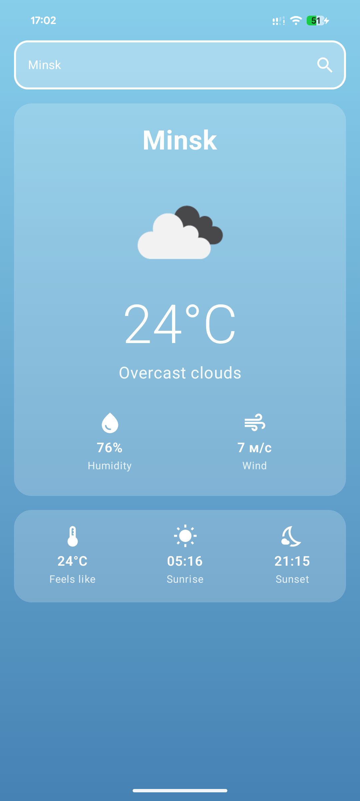
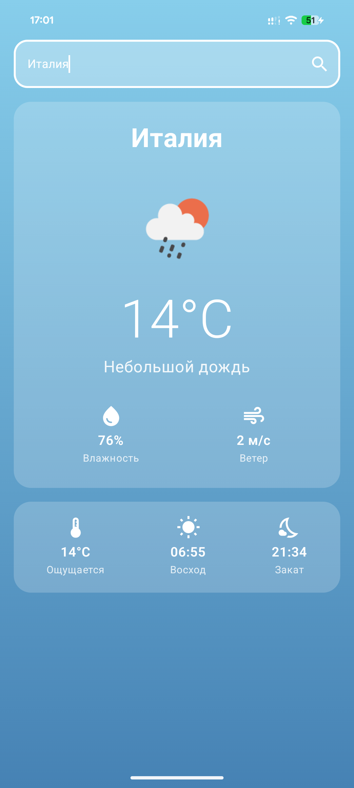
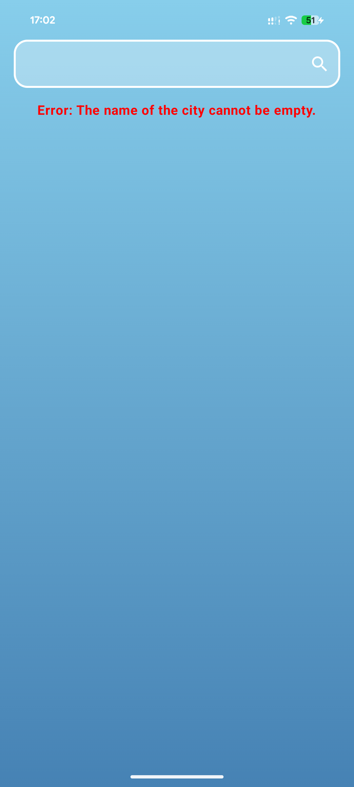

# Kotlin Weather App

A simple weather application for Android, built with Kotlin and Jetpack Compose. It fetches and displays current weather data from the OpenWeatherMap API.

<p align="center">
  
  
  
</p>

### Key Technologies

-   **Language:** Kotlin
-   **UI:** Jetpack Compose (Material 3)
-   **Architecture:** MVVM
-   **Networking:** Retrofit & Gson
-   **Asynchronicity:** Kotlin Coroutines
-   **Image Loading:** Coil

### Setup
To run the app, you need an API key from [OpenWeatherMap](https://openweathermap.org/). Create a `local.properties` file in the root directory and add your key:
```properties
API_KEY=YOUR_API_KEY_HERE
```
